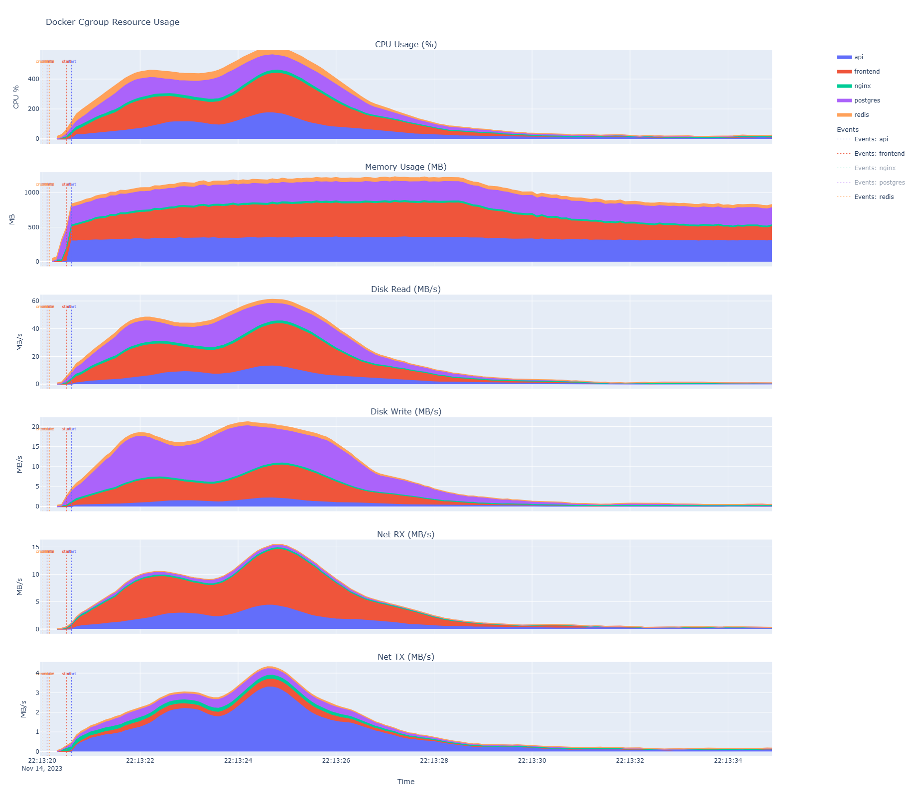

# Docker Cgroup Monitor

Tired of slow docker compose startup times? This tool will help you find out what system resources your containers use during startup and application runtime.
The tool produces an interactive chart of resources used by all of the containers in a timeline like this ([check interactive HTML yourself](example/cgroup_report.html)):



## How it works
Samples CPU, memory and disk/network IO from Docker container cgroups at high frequency, then produces interactive HTML charts. The tool only works for Linux.

## Prerequisites
- Linux with cgroup v2
- [uv](https://docs.astral.sh/uv/getting-started/installation/)
- [go1.21 or later](https://go.dev/doc/install)

## Install

```bash
go install github.com/antonvlasov/dockerblame@latest
```

## Collect data

Run as root (needed for cgroup access):

```bash
sudo dockerblame
```

Let it run while your workload executes, then press Ctrl+C to stop. Output is written to a timestamped folder like `dockerblame_2026-02-17_15-04-05/`.

### Collector flags

| Flag | Default | Description |
|------|---------|-------------|
| `-interval` | `100ms` | Sampling interval |
| `-cgroupbase` | `/sys/fs/cgroup/system.slice` | Base cgroup path |

## Generate the report

```bash
uv run https://raw.githubusercontent.com/antonvlasov/dockerblame/master/graph.py dockerblame_2026-02-17_15-04-05
```

On first run, `uv` will automatically download Python and install dependencies. Open `cgroup_report.html` in a browser.

### Grapher flags

| Flag | Default | Description |
|------|---------|-------------|
| `--smooth-window` | `10` | Rolling average window for CPU chart |


## License

[License](LICENSE)